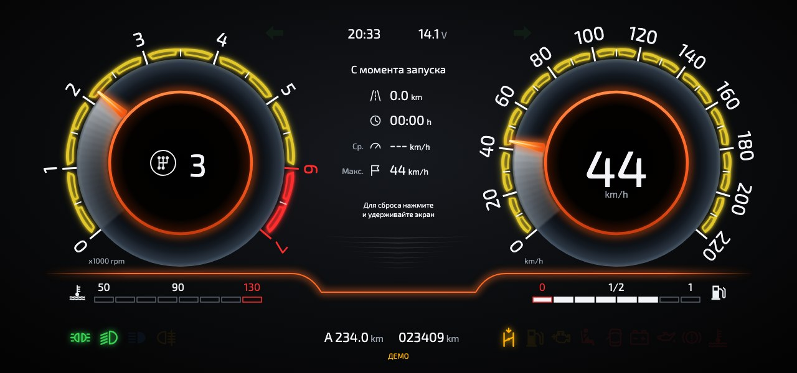
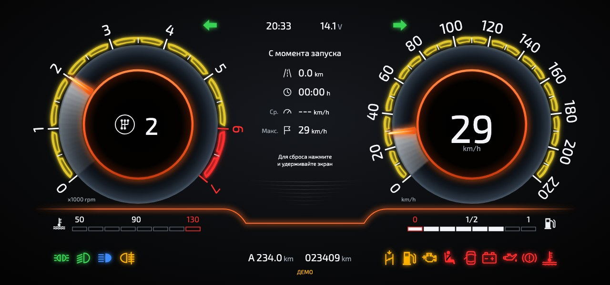
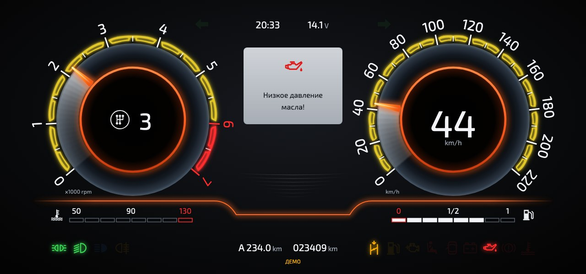
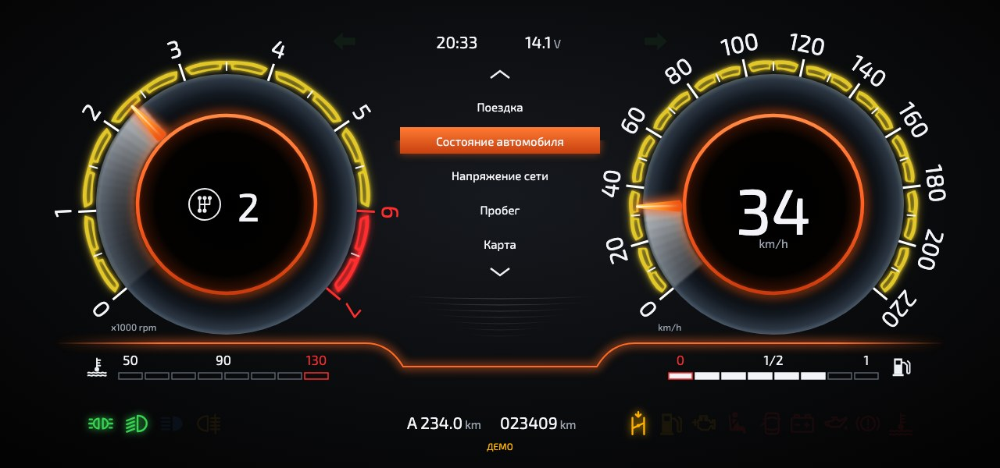
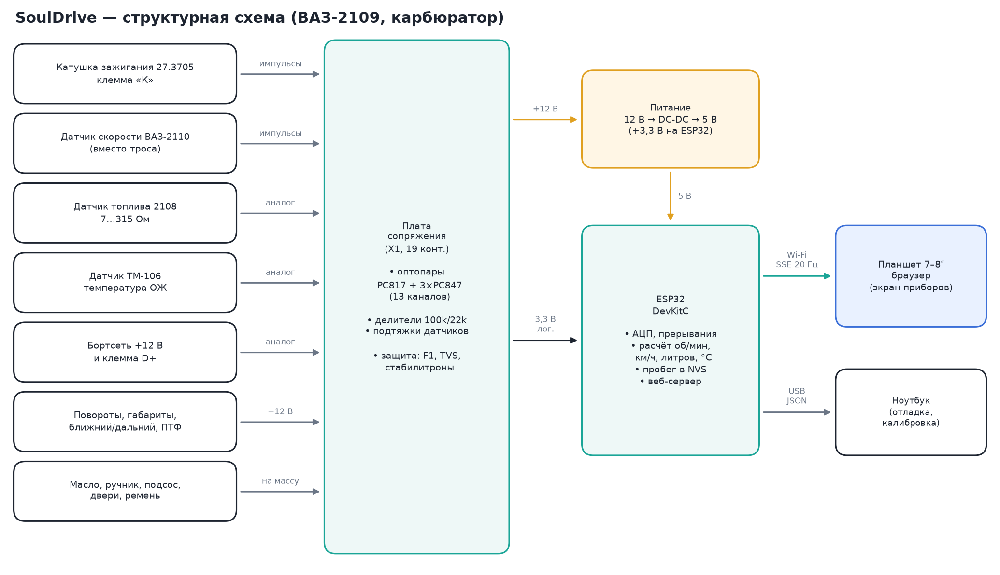
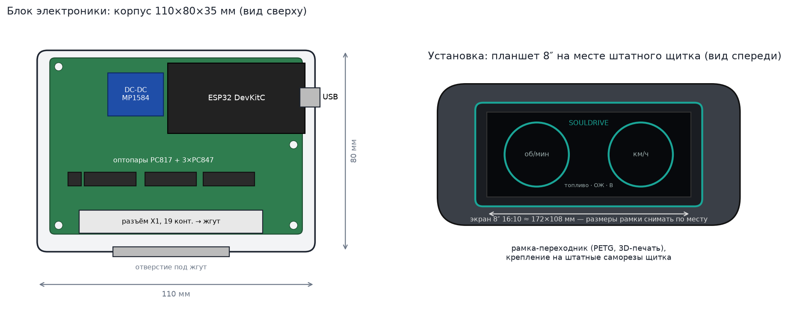

# SoulDrive — цифровая панель приборов для ВАЗ-2109

SoulDrive заменяет штатный стрелочный щиток карбюраторной «девятки» на экран
планшета. Плата на ESP32 читает датчики автомобиля напрямую, без CAN и OBD,
которых на карбюраторной 2109 нет. Она раздаёт Wi-Fi, а планшет показывает
приборы в обычном браузере.



| Все лампы (`?demo&lamps`) | Предупреждение (`?demo&alert`) | Меню бортового компьютера |
|---|---|---|
|  |  |  |


**Демо-ролик (60 с):** [docs/SoulDrive_demo_music.mp4](docs/SoulDrive_demo_music.mp4) с музыкой,
[docs/SoulDrive_demo.mp4](docs/SoulDrive_demo.mp4) без звука. Ролик отрисован покадрово из этого же
`web/index.html` скриптом `tools/make_video.py`. Музыку синтезирует `tools/make_music.py`, она своя, без чужих сэмплов.
В конце ролика логотип из брендбука SoulDrive: значок SD и надпись SOULDRIVE, белые PNG в `web/brand/`, вырезаны из PDF брендбука.

## Что показывает

| Параметр | Источник на 2109 |
|---|---|
| Обороты двигателя | клемма «К» катушки зажигания |
| Скорость, пробег, суточный пробег | датчик скорости ВАЗ-2110, ставится вместо троса спидометра |
| Уровень топлива, лампа резерва | штатный датчик 2108-3827010 |
| Температура ОЖ, перегрев | штатный датчик ТМ-106 |
| Напряжение бортсети, контроль заряда | +12 В и клемма D+ генератора |
| Повороты, габариты, ближний, дальний, задний ПТФ | цепи контрольных ламп (+12 В) |
| Давление масла, ручник/ТЖ, подсос, открытые двери, ремень | датчики и концевики, замыкающие на массу |
| Check Engine | самодиагностика SoulDrive: обрыв/замыкание датчиков, бортсеть вне нормы |

## Структура проекта

```
firmware/          прошивка ESP32 (PlatformIO, Arduino)
  src/config.h     распиновка и калибровки под ВАЗ-2109
  src/inputs.cpp   чтение датчиков, расчёт оборотов, скорости, литров, °C
  src/main.cpp     Wi-Fi, веб-сервер, поток данных
  src/telemetry_json.h  формат JSON для планшета
  test_host/       виртуальный стенд: прошивка + модель автомобиля на компьютере
web/               экран приборов (заливается в LittleFS ESP32)
  index.html       разметка: 2 шкалы, бортовой компьютер, индикация (SVG)
  css/style.css    стили
  css/fonts/       шрифт Exo 2 (SIL OFL 1.1), работает без интернета
  js/app.js        логика экрана: шкалы, меню, карта, демо-режим, приём данных
  js/icons.js      значки контрольных ламп в стиле ISO 2575
  img/scale-segment.svg  секция шкалы (рисунок автора), по ней построена дуга делений
  brand/           логотип SoulDrive
hardware/
  SoulDrive_docs.pdf  весь комплект: схема (5 листов A3 со штампом), перечень, плата
  schematic/       листы принципиальной схемы, SVG/PNG
  pcb/             макет печатной платы 100×70 мм: верх, низ, вид в сборе (PNG/SVG)
  BOM.xlsx         перечень элементов, Excel (шрифт Arial)
  BOM.csv          то же в CSV (UTF-8, разделитель «;»)
docs/
  WIRING_2109.md   подключение к жгуту 2109
  CALIBRATION.md   калибровка датчиков
  img/             структурная схема, макеты экрана, корпуса и установки
tools/             скрипты, генерирующие схемы, плату, рисунки и ролик
```

## Быстрый старт

### Посмотреть экран без железа

Откройте `web/index.html` в браузере. Страница сама перейдёт в демо-режим.

### Собрать и прошить

```bash
pip install platformio
cd firmware
pio run -t upload        # прошивка
pio run -t uploadfs      # экран приборов в память ESP32
```

Демо-прошивка выдаёт тестовые данные и работает без машины. Удобно для защиты проекта:

```bash
pio run -e esp32dev-demo -t upload && pio run -e esp32dev-demo -t uploadfs
```

Подключите планшет к Wi-Fi **SoulDrive** (пароль `souldrive2109`) и откройте
`http://192.168.4.1`.

### Перегенерировать схемы и рисунки

```bash
pip install schemdraw matplotlib numpy scipy
python tools/gen_pcb.py          # трассировка и рендер платы (~30 с)
python tools/gen_schematics.py   # листы схемы и hardware/SoulDrive_docs.pdf
python tools/gen_diagrams.py
```

### Инструменты

| Скрипт | Что делает | Зависимости |
|---|---|---|
| `tools/sd_design.py` | таблица соединений: общие обозначения для схемы и платы | — |
| `tools/gen_pcb.py` | размещение, трассировка и рендер платы → `hardware/pcb/` | matplotlib, numpy, scipy |
| `tools/gen_schematics.py` | листы схемы A3 и `hardware/SoulDrive_docs.pdf` | schemdraw, matplotlib |
| `tools/gen_diagrams.py` | структурная схема, корпус и установка → `docs/img/` | matplotlib |
| `tools/make_screens.py` | скриншоты экрана в демо-режиме → `docs/img/ui_*.jpg` | playwright |
| `tools/make_video.py` | демо-ролик 60 с, 1920×1080 → `docs/SoulDrive_demo.mp4`; с аргументами `5 30 44` — только кадры на этих секундах (PNG) | playwright, imageio-ffmpeg |
| `tools/make_music.py` | музыка к ролику → `docs/SoulDrive_music.wav` | numpy |

Для скриптов с Playwright один раз выполните `python -m playwright install chromium`.

## Архитектура



- **Входы.** Все дискретные сигналы и тахометр развязаны оптопарами (PC817 для тахометра, 3×PC847 для остальных):
  бортсеть автомобиля «грязная», на катушке бывают выбросы в сотни вольт.
  Аналоговые сигналы идут через делители и RC-фильтры на ADC1 (ADC2 на ESP32
  занят Wi-Fi).
- **Обороты и скорость** считаются по периоду между импульсами в прерывании.
  Слишком короткие импульсы отбрасываются как звон. Если импульсов нет дольше
  тайм-аута, значение обнуляется.
- **Топливо** сильно сглаживается, потому что бензин плещется в баке.
  Сопротивление датчиков пересчитывается в литры и °C по калибровочным таблицам.
- **Пробег** сохраняется в энергонезависимую память (NVS) каждые 100 м.
- **Передача данных:** Server-Sent Events, 20 кадров в секунду. Экран — обычная
  веб-страница, поэтому подойдёт любой планшет или телефон.

## Макеты



## Проверка на виртуальном стенде

Без машины и без платы прошивку можно проверить на компьютере. `firmware/test_host`
собирает **тот же** `inputs.cpp` и формат JSON, что идут в ESP32. Вместо автомобиля
работает модель на уровне сигналов: искры катушки со «звоном», импульсы датчика
скорости с помехами, напряжения через настоящие делители и подтяжки, АЦП ESP32 с его
«мёртвой зоной» ниже ~150 мВ, контрольные лампы с дребезгом контактов.

```bash
firmware/test_host/run.sh      # 83 проверки + сохранение пробега после выключения питания
python firmware/test_host/e2e.py   # кадры прошивки → SSE → настоящий web/index.html в браузере
```

Что проверяется: пуск двигателя, обороты 200–6500 и перегазовка, скорость 3–180 км/ч,
помехи на линии скорости, пробег на 10 км и сброс суточного, переполнение `micros()`,
топливо и ОЖ по всей шкале, обрыв и замыкание датчиков, бортсеть, все 11 ламп,
поворотник с дребезгом, остановка, формат JSON и то, что экран понимает каждое поле.

Стенд нашёл и помог исправить: ложный резерв топлива после каждого включения,
полный бак, который АЦП не видел (подтяжка 330 → 100 Ом), скачки скорости до 353 км/ч
от одной помехи и накрутку пробега помехами (медиана периодов + ограничение
ускорения), невидимый обрыв датчика топлива.

## Ограничения и что проверить на машине

- Таблицы датчиков топлива и температуры типовые. Их нужно откалибровать на
  конкретном автомобиле, см. [CALIBRATION.md](docs/CALIBRATION.md).
- Константу датчика скорости (6004 имп/км) нужно уточнить по GPS.
- Между +12 В и D+ генератора **обязательно** нужна лампа или резистор
  возбуждения, см. [WIRING_2109.md](docs/WIRING_2109.md).
- Стенд проверяет логику прошивки, но не саму плату. На собранной плате
  мультиметром стоит сверить напряжение бортсети: стабилитрон 3,3 В на входах VBAT и D+
  может подтекать уже при 2,6 В (это 14,4 В в бортсети) и занижать показания.
  Если панель показывает меньше мультиметра на 0,2 В и больше, замените стабилитрон
  на BZX84C3V6 или подстройте `DIVIDER_RATIO`.
- Модель АЦП ESP32 в стенде приближённая (по документации Espressif); точные
  значения конкретного экземпляра даёт калибровка.

## Дизайн экрана

Основной экран (`index.html`) сделан по мотивам цифровой панели Lada Vesta NG:
- две шкалы с жёлтыми сегментными дугами и подсветкой за стрелкой;
- оранжевые кольца вокруг центральных дисков;
- бортовой компьютер в центре;
- горизонтальные шкалы ОЖ и топлива внизу.

Всё нарисовано с нуля в SVG. Фирменный шрифт LADA закрытый, поэтому вместо него
взят свободный **Exo 2** (SIL OFL 1.1, лицензия в `web/css/fonts/OFL.txt`).

Что делает экран:
- **Расчётная передача** в центре тахометра. Определяется по отношению скорости
  к оборотам с учётом передаточных чисел КПП 2109 и колёс 175/70 R13.
- **Бортовой компьютер** с меню, как на Весте. Нажатие на верх или низ центра
  листает разделы, выбранный подсвечивается оранжевым. Через 2,5 с открывается сам раздел:
  - «Поездка»: путь, время, средняя и максимальная скорость с момента запуска;
  - «Состояние автомобиля»: ОЖ, топливо, обороты;
  - «Напряжение сети»: вольты и состояние зарядки;
  - «Пробег»: суточный A и общий;
  - «Карта»: шкалы уменьшаются и плавно уходят к краям, в центре открывается
    навигация (`?demo&map` — сразу в этом режиме). Есть плашка следующего манёвра
    с расстоянием и улицей, знак ограничения скорости (цифра скорости краснеет
    при превышении больше чем на 5 км/ч), остаток пути, время прибытия и время в пути.
    Карта поворачивается по ходу движения, при разгоне масштаб уменьшается.
    Это **офлайн-демо**: в машине нет интернета, а у ESP32 нет GPS. Поэтому город
    и кольцевой маршрут (7,2 км) нарисованы в коде, а метка едет по ним с реальной
    скоростью с датчика. Для настоящей навигации нужны GPS-модуль и офлайн-тайлы.
- **Эффекты:**
  - веерная подсветка за стрелкой, ярче всего у самой стрелки;
  - светящиеся оранжевые кольца и линии, гаснущие к краям;
  - стрелка с белой сердцевиной;
  - стальной градиент колец.
- **Предупреждения** выводятся серой карточкой поверх бортового компьютера:
  давление масла, заряд, перегрев, ручник/ТЖ, напряжение, резерв топлива.

## Происхождение идеи

Идея заменить щиток экраном, на который выводятся данные с датчиков автомобиля,
взята у проекта **Venator** (разработчик Frud, форум compcar.ru; описания сборки
на [drive2.ru](https://www.drive2.ru/l/495724164305387809/) и
[pikabu.ru](https://pikabu.ru/story/kak_ya_sobiral_panel_priborov_venator_7264770)).
Venator — закрытый коммерческий продукт: Arduino Mega, шилд и Android-приложение
на Adobe AIR.

В SoulDrive **не использованы** код, схемы или файлы Venator. Здесь разработаны свои:
- прошивка;
- схема входных цепей на оптопарах;
- адаптация под ВАЗ-2109;
- веб-интерфейс вместо закрытого приложения.

## Лицензия

MIT, см. [LICENSE](LICENSE).
